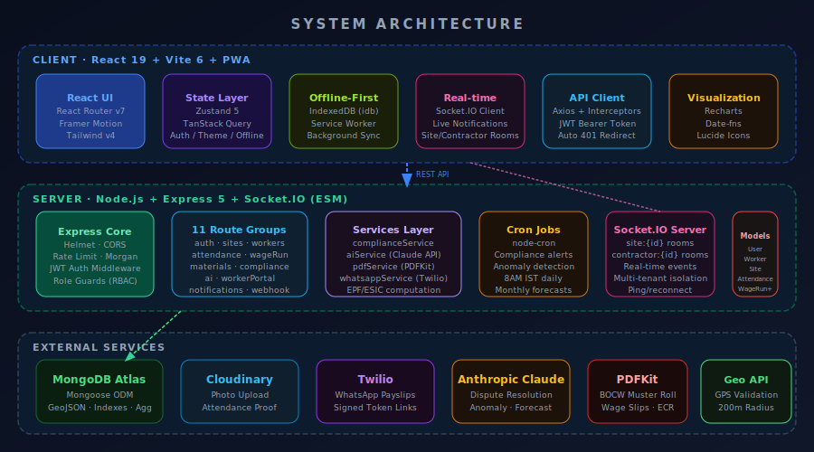
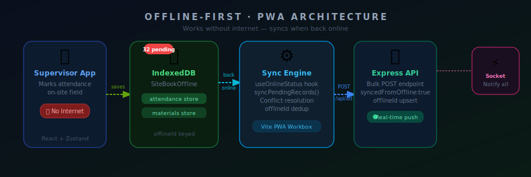

<div align="center">


<br/>

> **Construction labour management finally built for the ground — not the boardroom.**  
> GPS attendance. Auto-calculated wages. Statutory compliance. AI-powered insights.  
> One platform, three roles, zero spreadsheets.

<br/>

[](https://nodejs.org)
[](https://react.dev)
[](https://expressjs.com)
[](https://mongodb.com)
[](https://socket.io)
[](https://vitejs.dev)
[](https://tailwindcss.com)
[](https://web.dev/progressive-web-apps)

</div>

---

## What is SiteBook?

Construction sites run on paper registers, WhatsApp forwards, and guesswork. Contractors lose money to attendance fraud, compliance officers miss EPF deadlines, and workers have no way to verify their own payslips.

**SiteBook is the full-stack operating system that replaces all of that.**

- A **contractor** opens the app, sees live attendance across 7 sites, generates a wage run in 30 seconds, and dispatches payslips via WhatsApp — all before lunch.
- A **supervisor** in a remote site marks attendance offline, the data queues locally in IndexedDB, and syncs the moment signal returns.
- A **compliance officer** logs in, reviews EPF/ESIC status across every site, and exports the BOCW Muster Roll as a ready-to-file PDF.
- A **worker** scans a WhatsApp link and views their wage slip — no app download, no login, just a signed token.

Built with the full MERN stack, real-time Socket.IO events, PWA offline support, and Claude AI for dispute resolution and anomaly detection.

---

## Live Dashboard



The contractor dashboard pulls live compliance deadlines, wage run summaries, weekly attendance charts, and a real-time activity feed — all behind a glassmorphism UI that works in both dark and light mode.

---

## System Architecture



### How the pieces connect

The project is a **monorepo** with three concerns cleanly separated:

```
SiteBook/
├── client/          # React 19 + Vite 6 + Tailwind v4 frontend
│   ├── src/
│   │   ├── api/        # Axios client with JWT interceptors
│   │   ├── components/ # GlassCard, DataTable, Modal, StatusBadge...
│   │   ├── hooks/      # useGeolocation, useOnlineStatus
│   │   ├── pages/      # contractor/, supervisor/, compliance/, worker/
│   │   ├── store/      # Zustand stores: auth, theme, offline
│   │   └── utils/      # offlineDB (IndexedDB), socket.js, sync.js
│   └── vite.config.js  # PWA (Workbox), Tailwind plugin, dev proxy
│
├── server/          # Express 5 + Socket.IO + Mongoose backend
│   └── src/
│       ├── config/     # env validation, MongoDB connection
│       ├── controllers/# Business logic per resource
│       ├── jobs/       # node-cron: compliance alerts, AI anomaly
│       ├── middleware/ # JWT auth, role guards (RBAC), error handler
│       ├── models/     # User, Worker, Site, Attendance, WageRun, Material, Notification
│       ├── routes/     # 11 Express routers
│       ├── services/   # complianceService, aiService, pdfService, whatsappService
│       └── utils/      # constants (EPF/ESIC rates, deadlines), helpers
│
└── package.json     # concurrently dev script, monorepo root
```

The server uses **ES Modules throughout** (`"type": "module"`), runs on **Express 5** (first stable major in a decade), and the HTTP server is shared with **Socket.IO** for zero-overhead real-time events.

The client proxies `/api` requests to `localhost:5000` in dev. In production, Express serves the built Vite output from the same port.

---

## Role-Based Access Control



Three portals share one backend but see entirely different worlds:

| Capability | Contractor | Supervisor | Compliance Officer |
|---|:---:|:---:|:---:|
| Dashboard analytics | ✅ | ❌ | ❌ |
| Create / manage sites | ✅ | ❌ | ❌ |
| Register workers | ✅ | ❌ | ❌ |
| Mark attendance | ✅ | ✅ | ❌ |
| Offline attendance sync | ✅ | ✅ | ❌ |
| Generate wage runs | ✅ | ❌ | ❌ |
| Export BOCW Muster Roll | ✅ | ❌ | ✅ |
| EPF/ESIC compliance view | ✅ | ❌ | ✅ |
| AI Insights | ✅ | ❌ | ❌ |
| WhatsApp payslip dispatch | ✅ | ❌ | ❌ |
| Material inventory | ✅ | ✅ | ❌ |
| Worker portal (payslip) | 🔗 Public token-auth link | | |

Role enforcement happens at two layers: Express middleware (`roleGuard.js`) rejects unauthorized API calls with 403, and the React router redirects unauthorized UI access to `/unauthorized`.

---

## Wage Run Pipeline + AI Engine



### The wage run in five steps

**1. Attendance aggregation** — MongoDB aggregation pipeline groups all `Attendance` documents for a site by worker, summing full days, half days, overtime hours, and computing base pay using the `agreedRate` on the worker record.

**2. OT calculation** — Overtime is billed at `1.5×` the daily rate (configurable per site via `overtimeRateMultiplier`). The `STANDARD_HOURS_PER_DAY = 8` constant anchors the calculation.

**3. Statutory deductions** — `complianceService.computeEpfEsic()` applies:
- **EPF**: 12% employer + 12% employee, capped at ₹15,000 wage ceiling
- **ESIC**: 3.25% employer + 0.75% employee, capped at ₹21,000 wage ceiling

**4. Approval flow** — Wage runs move through `draft → approved → paid`. Only `approved` runs can be marked paid. Only contractors can approve.

**5. Dispatch** — `pdfService` generates a PDFKit wage slip and a BOCW-compliant Muster Roll. `whatsappService` sends a Twilio-signed token link to each worker's phone.

### Claude AI features

Three endpoints backed by `claude-3-5-sonnet-20241022`:

**Anomaly Detection** (`GET /api/ai/anomalies`) — Cross-references attendance patterns against statistical baselines. Flags impossible GPS jumps, perfect 100%-attendance streaks, and budget overruns. Runs automatically via `node-cron` at 8:00 AM IST daily.

**Dispute Resolution** (`POST /api/ai/resolve-dispute`) — Contractor enters a worker's phone number and the complaint text. The AI fetches that worker's full attendance and wage history from MongoDB, applies BOCW Act rules, and returns a structured resolution with reasoning.

**Budget Forecasting** (`GET /api/ai/forecast`) — Analyses historical wage runs to project next month's labour cost per site. Visualized with Recharts on the AI Insights page.

All AI features degrade gracefully — if `CLAUDE_API_KEY` is absent in `.env`, responses return mock data with a clear flag, so the rest of the app works fine.

---

## Offline-First Architecture



This was built for real construction sites — patchy signal, dusty phones, field supervisors who can't wait for a page to load.

**How offline attendance works:**

1. Supervisor opens the attendance page — workers load from the server (or from TanStack Query's 30-second stale cache).
2. Supervisor marks statuses. On save, if `navigator.onLine === false`, records are written to **IndexedDB** (`SiteBookOffline` DB, `attendance` store) with a random `offlineId` and `synced: false`.
3. The `useOnlineStatus` hook listens to `window.addEventListener('online')`. The moment connection returns, `syncPendingRecords()` reads all unsynced records, POSTs them to `/api/attendance/bulk`, and marks them `synced: true`.
4. The server accepts `syncedFromOffline: true` records with `offlineId` for idempotent upsert — re-sending the same offline batch never creates duplicates.
5. A pending count badge in the top bar shows the supervisor how many records are queued.

**PWA layer** (via `vite-plugin-pwa` + Workbox):
- Service Worker with `NetworkFirst` strategy for all `/api/*` routes (5s timeout, then cache)
- Full asset precaching — JS, CSS, HTML, icons, fonts
- Installable on Android home screen — `manifest.json` with splash, icons, `standalone` display mode

---

## Data Models

Seven Mongoose schemas power the platform:

### `User` — Contractor / Supervisor / Compliance Officer
Fields: `name`, `email`, `phone`, `password (bcrypt)`, `role`, `contractorId` (self-ref FK for hierarchy), `assignedSites[]`, `bocwRegNo`, `contractorLicenseNo`, JWT `refreshToken`. Pre-save hook auto-hashes passwords.

### `Worker` — Labour on a site
Fields: `name`, `fatherName`, `phone`, `aadhaarLast4`, `skill` (enum: unskilled → highly\_skilled), `siteId`, `contractorId`, `agreedRate`, `bankDetails` (accountNumber, ifsc, upiId), `esicNumber`, `epfUan`, `appointmentLetterGenerated`.

### `Site` — Construction site
Fields: `name`, `contractorId`, `location` (GeoJSON Point — coordinates + radius for geo-validation), `wageRates[]` (skill → dailyRate + OT multiplier), `supervisors[]`, `budget`, `status` (active/inactive/completed). Has a `2dsphere` index for geospatial queries.

### `Attendance` — Daily record per worker
Fields: `workerId`, `siteId`, `contractorId`, `date`, `status` (full/half/absent/overtime), `overtimeHours`, `photoUrl` (Cloudinary), `markedBy`, `geoValidated`, `geoCoordinates` (GeoJSON), `syncedFromOffline`, `offlineId`. Compound index on `(siteId, date)`.

### `WageRun` — Monthly payroll snapshot
Fields: `siteId`, `contractorId`, `month`, `year`, `status` (draft/approved/paid), `workers[]` (embedded wage entries: basePay, overtimePay, grossPay, epfEmployer/Employee, esicEmployer/Employee, netPayable, adjustments[]). Top-level: `totalLabourCost`, `totalNetPayable`, `totalEpfEmployer/Employee`, `totalEsicEmployer/Employee`, `budgetVariance`, `paymentReference`.

### `Material` — Site inventory
Fields: `siteId`, `contractorId`, `name`, `unit`, `currentStock`, `minimumStock`, `transactions[]` (inward/outward with quantity, rate, supplier, date).

### `Notification` — In-app alerts
Fields: `userId`, `contractorId`, `type` (compliance\_deadline/anomaly/wage\_run/system), `title`, `message`, `severity` (info/warning/critical), `link`, `read`. Indexed on `(userId, read, createdAt)` for fast unread counts.

---

## API Reference

The server exposes **11 route groups**, all under `/api`. Every protected route requires `Authorization: Bearer <jwt>`.

| Group | Method + Path | Who | What |
|---|---|---|---|
| **Auth** | `POST /auth/register` | Public | Register contractor/supervisor/CO |
| | `POST /auth/login` | Public | Returns JWT + user |
| | `GET /auth/me` | Any | Current user profile |
| **Sites** | `GET /sites` | Any | List contractor's sites |
| | `POST /sites` | Contractor | Create site with wage rates |
| | `POST /sites/:id/assign-supervisor` | Contractor | Link supervisor to site |
| **Workers** | `GET /workers` | Any | Filter by siteId |
| | `POST /workers` | Contractor | Add worker with agreed rate |
| | `POST /workers/bulk` | Contractor | CSV bulk import |
| **Attendance** | `POST /attendance` | Any | Mark single record |
| | `POST /attendance/bulk` | Any | Offline sync batch |
| | `GET /attendance/daily/:siteId/:date` | Any | Day's attendance sheet |
| | `GET /attendance/summary` | Any | Site attendance summary |
| **Wage Runs** | `POST /wage-runs/generate` | Contractor | Compute from attendance |
| | `POST /wage-runs/:id/approve` | Contractor | Move to approved |
| | `POST /wage-runs/:id/mark-paid` | Contractor | Mark paid + reference |
| | `GET /wage-runs/:id/muster-roll` | Any | Download BOCW PDF |
| | `GET /wage-runs/:id/ecr` | Any | Export EPF ECR file |
| | `GET /wage-runs/:wageRunId/wage-slip/:workerId` | Any | Worker wage slip PDF |
| **AI** | `POST /ai/resolve-dispute` | Contractor | Claude-powered resolution |
| | `GET /ai/anomalies` | Contractor | Attendance anomaly scan |
| | `GET /ai/forecast` | Contractor | Labour cost forecast |
| **Worker Portal** | `GET /worker-portal/payslip/view?token=` | Public | Token-auth payslip page |
| **Compliance** | `GET /compliance/report` | Any | Full statutory report |
| | `GET /compliance/deadlines` | Any | Upcoming EPF/ESIC due dates |
| **Notifications** | `GET /notifications` | Any | Unread notification list |
| **Webhooks** | `POST /webhook` | Service | External event ingestion |

### Security layers
- **Helmet** — 11 HTTP security headers
- **express-rate-limit** — 429 on API abuse
- **express-validator + zod** — input validation at route and service layers
- **bcryptjs** — password hashing (10 rounds)
- **JWT** — access tokens (short-lived) + refresh tokens (crypto.randomBytes)
- **RBAC middleware** — `contractorOnly()`, `supervisorOnly()`, `complianceOfficerOnly()` guards

---

## UI Component System

The frontend is built on a custom design system using **CSS custom properties** (no Tailwind JIT config — pure Tailwind v4 `@theme` block in `index.css`).

### Colour palette

| Token | Dark | Light | Use |
|---|---|---|---|
| `--color-surface` | `#0f172a` | `#f1f5f9` | Page background |
| `--color-surface-light` | `#1e293b` | `#e2e8f0` | Card background |
| `--glass-bg` | `rgba(255,255,255,0.05)` | `rgba(255,255,255,0.7)` | Glassmorphism fill |
| `--color-primary-500` | `#3b82f6` | same | Actions, links |
| `--color-accent-500` | `#10b981` | same | Success states |
| `--color-text-muted` | `#94a3b8` | `#64748b` | Secondary text |

### Core components

**`GlassCard`** — The foundational card. `glass` class = `backdrop-filter: blur(12px)` + `--glass-bg` fill + `--glass-border` stroke. `hover` prop adds `glass-hover` for interactive lift.

**`StatusBadge`** — Polymorphic pill for skill tiers, attendance statuses, compliance severities. Colour-maps from enum values.

**`DataTable`** — Typed column-definition table with render functions. Used across every list view.

**`Modal`** — Framer Motion animated portal overlay with `AnimatePresence` exit animations.

**`Button`** — Variant-based (primary/secondary/ghost/danger) with loading state.

**`LoadingSpinner`** / **`EmptyState`** — Consistent feedback primitives used across all async views.

All pages use `framer-motion`'s `AnimatePresence` with `pageVariants` (`opacity 0→1, y 12→0`) for route transitions.

---

## Getting Started

### Prerequisites

- Node.js ≥ 22
- MongoDB Atlas URI (or local `mongod`)
- (Optional) Cloudinary account, Twilio account, Anthropic API key

### Setup

```bash
# Clone the repo
git clone https://github.com/sat1828/SiteBook.git
cd SiteBook

# Install all dependencies (root + server + client)
npm run install:all

# Configure environment
cp server/.env.example server/.env
# Edit server/.env with your values (see below)

# Start dev servers (concurrently)
npm run dev
```

Client runs on `http://localhost:5173`, server on `http://localhost:5000`. The Vite dev server proxies `/api` to the Express server.

### Environment Variables (`server/.env`)

```env
# Required
NODE_ENV=development
PORT=5000
MONGODB_URI=mongodb+srv://...
JWT_SECRET=your-long-random-secret
JWT_EXPIRES_IN=7d
CLIENT_URL=http://localhost:5173

# Optional — AI features
CLAUDE_API_KEY=sk-ant-...

# Optional — Photo uploads
CLOUDINARY_CLOUD_NAME=...
CLOUDINARY_API_KEY=...
CLOUDINARY_API_SECRET=...

# Optional — WhatsApp payslips
TWILIO_ACCOUNT_SID=...
TWILIO_AUTH_TOKEN=...
TWILIO_WHATSAPP_FROM=whatsapp:+14155238886
```

Features degrade gracefully without optional keys — the app remains fully functional, AI returns mock responses, and WhatsApp sends are logged to console.

### Build for production

```bash
npm run build          # Vite build → client/dist/
npm start              # Express serves dist/ + handles API
```

---

## Compliance Coverage

SiteBook handles statutory compliance under **three Indian labour laws**:

**Building & Other Construction Workers Act, 1996 (BOCW)**
- BOCW registration number tracked per contractor
- Muster Roll generated in the format prescribed under BOCW (RECS) Central Rules, 1998
- BOCW Cess at 1% of construction cost tracked in `complianceService`
- Deadline alerts (day configurable in `COMPLIANCE_DEADLINES` constant)

**Employees' Provident Fund Act, 1952**
- 12% employer + 12% employee contribution computed automatically
- Wage ceiling at ₹15,000 per month
- ECR (Electronic Challan-cum-Return) export endpoint
- 15th of every month deadline with 7-day advance notification

**Employees' State Insurance Act, 1948**
- 3.25% employer + 0.75% employee computed per wage run
- Wage ceiling at ₹21,000 per month
- 15th of every month deadline with notification

**Code on Wages, 2019**
- Skill tier classification: unskilled / semi-skilled / skilled / highly-skilled
- Overtime at 1.5× rate enforced in wage computation
- Appointment letter generation for each worker (PDF)

---

## Real-Time Events

Socket.IO rooms isolate events by tenant:

```
site:{siteId}         → All users watching a specific site
contractor:{id}       → Contractor's private notification stream
```

Events emitted by the server:
- `attendance:marked` — when a supervisor marks/updates attendance
- `wageRun:generated` — when a wage run draft is created
- `notification:new` — compliance deadline, anomaly, system alerts

The client connects in `AppLayout.jsx` on mount, subscribes the user's `assignedSites[0]` room, and disconnects on unmount.

---

## Tech Stack

| Layer | Technology | Why |
|---|---|---|
| Frontend framework | React 19 | Latest concurrent features, `use()` hook |
| Build tool | Vite 6 | Instant HMR, ESM-native |
| Styling | Tailwind CSS v4 | Zero-config `@theme` block, no PostCSS needed |
| Animation | Framer Motion 11 | Spring physics, `AnimatePresence`, layout animations |
| State management | Zustand 5 | Minimal boilerplate, slice pattern, no Provider hell |
| Server state | TanStack Query 5 | Stale-while-revalidate, 30s cache, invalidation |
| HTTP client | Axios | Interceptors for JWT injection + 401 redirect |
| Offline storage | IndexedDB (idb) | Structured storage, indexed queries, no size limit |
| PWA | vite-plugin-pwa + Workbox | Service Worker, manifest, background sync |
| Icons | Lucide React | Consistent 24px stroke icons, tree-shakeable |
| Charts | Recharts | SVG charts, composable, dark-mode compatible |
| Backend | Express 5 | First stable major, improved error handling |
| Runtime | Node.js (ESM) | `"type": "module"`, `--watch` native dev server |
| ORM | Mongoose 8 | Schema validation, virtuals, aggregation pipeline |
| Database | MongoDB | GeoJSON, flexible schema, Atlas free tier works |
| Real-time | Socket.IO 4 | Rooms, reconnect, polling fallback |
| Auth | JWT + bcryptjs | Stateless, role claims in payload |
| Validation | express-validator + zod | Route-level + service-level double validation |
| PDF | PDFKit | Pure Node.js, no headless browser needed |
| Messaging | Twilio | WhatsApp Business API, signed payslip tokens |
| AI | Anthropic Claude API | claude-3-5-sonnet, dispute + anomaly + forecast |
| Media | Cloudinary | Attendance photo CDN, auto-optimization |
| Scheduling | node-cron | Daily compliance checks at 8AM IST |
| Security | Helmet, rate-limit | Standard production hardening |

---

## Project Philosophy

This isn't a tutorial CRUD app. Every architectural decision was made against a real constraint:

- **Offline-first** because construction sites have bad signal. IndexedDB queuing isn't a "nice to have" — it's the only way a supervisor can do their job.
- **Three-role RBAC** because contractors, supervisors, and compliance officers genuinely need different views of the same data — not different apps.
- **PDF generation server-side** because PDFKit requires no browser, no puppeteer, no Lambda — a single Node.js process streams the PDF buffer directly.
- **AI as a service layer** because Claude's API is consumed from the server, keeping the API key private and allowing the AI to query MongoDB directly before forming a response.
- **Socket.IO rooms per contractor/site** because multi-tenancy is not optional — contractor A must never receive contractor B's events.
- **Graceful degradation** because not every deployment has a Twilio account. Every external service has a mock path.

---

## License

MIT — do whatever you want with it.

---

<div align="center">

Built with intent by **[sat1828](https://github.com/sat1828)**

*If this cleared your mental model of what a production MERN stack looks like — drop a ⭐*

</div>
